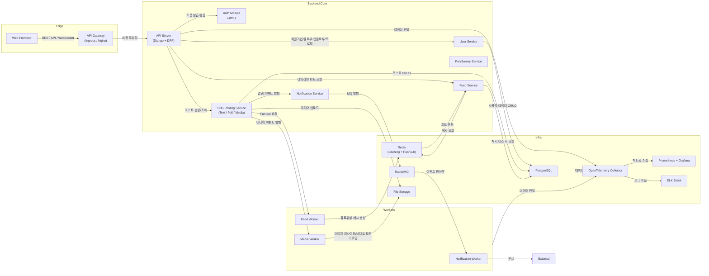

# 스토리움(Storyum) 컴포넌트 다이어그램

## 1. 문서 개요

**작성일**: 2025‑04‑24 
**작성자**: hannim 
**목적**: 스토리움(Storyum) 프로젝트의 컴포넌트 다이어그램을 작성하여 시스템 아키텍처를 시각적으로 표현 
**범위**: 사용자 관리, 포스팅·알림 기능 및 이를 뒷받침할 인프라·성능·보안·운영·확장·통합 요구사항 
**참고**: [Mermaid](https://mermaid-js.github.io/mermaid/#/) 문법을 사용하여 다이어그램을 작성 

## 2. 컴포넌트 다이어그램

> 스토리움 SNS 서비스의 컴포넌트 다이어그램은 시스템의 주요 구성 요소와 그들 간의 관계를 나타냅니다. 
> 이 다이어그램은 시스템 아키텍처를 이해하는 데 도움을 주며 각 컴포넌트의 역할과 상호작용을 명확히 합니다. 
> 단, 이 다이어그램은 실제 구현과 다를 수 있으며 시스템의 복잡성에 따라 추가적인 세부 사항이 필요할 수 있습니다. 

