# 스토리움(Storyum) 시퀀스 다이어그램

## 1. 개요

**작성일**: 2025.04.25 
**작성자**: hannim 
**목적**: 스토리움(Storyum) 프로젝트의 시퀀스 다이어그램을 작성하여 시스템의 동작을 시각적으로 표현 
**범위**: 사용자 관리, 포스팅·알림 기능 및 이를 뒷받침할 인프라·성능·보안·운영·확장·통합 요구사항 
**참고**: [Mermaid](https://mermaid-js.github.io/mermaid/#/) 문법을 사용하여 다이어그램을 작성 

## 2. 시퀀스 다이어그램

> 스토리움 SNS 서비스의 시퀀스 다이어그램은 시스템의 주요 기능을 시나리오별로 표현하여 시스템의 동작을 이해하는 데 도움을 줍니다. 
> 이 다이어그램은 각 기능의 흐름을 시각적으로 나타내며 시스템의 상호작용을 명확히 합니다. 
> 단, 이 다이어그램은 실제 구현과 다를 수 있으며 시스템의 복잡성에 따라 추가적인 세부 사항이 필요할 수 있습니다. 

### 2.1. 사용자 회원가입 시퀀스 다이어그램

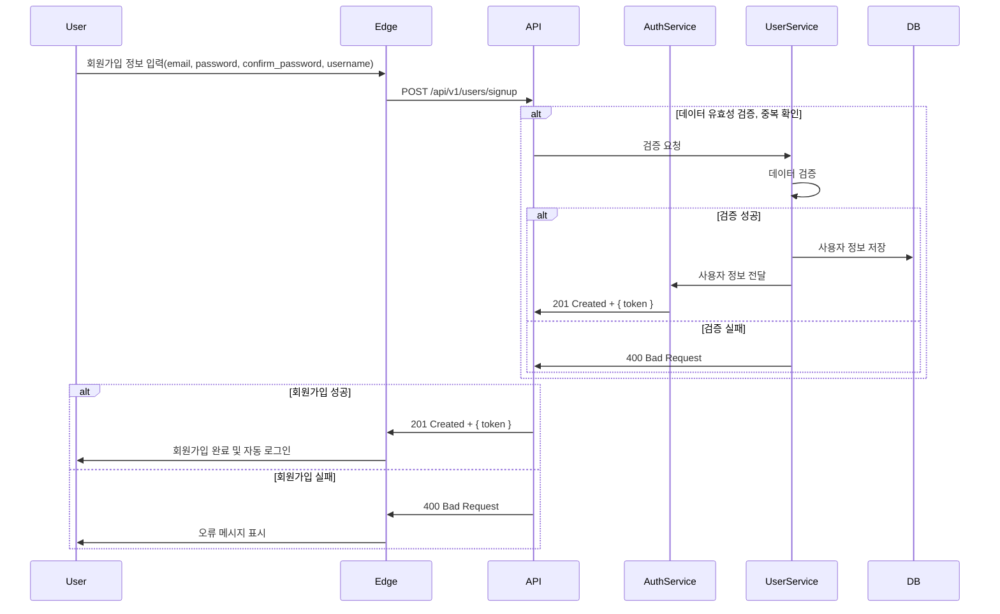
```mermaid
sequenceDiagram
    participant User
    participant Edge
    participant API
    participant AuthService
    participant UserService
    participant DB

    User->>Edge: 회원가입 정보 입력(email, password, confirm_password, username)
    Edge->>API: POST /api/v1/users/signup
    alt 데이터 유효성 검증, 중복 확인
        API->>UserService: 검증 요청
        UserService->>UserService: 데이터 검증
        alt 검증 성공
            UserService->>DB: 사용자 정보 저장
            UserService->>AuthService: 사용자 정보 전달
            AuthService->>API: 201 Created + { token }
        else 검증 실패
            UserService->>API: 400 Bad Request
        end
    end
    alt 회원가입 성공
        API->>Edge: 201 Created + { token }
        Edge->>User: 회원가입 완료 및 자동 로그인
    else 회원가입 실패
        API->>Edge: 400 Bad Request
        Edge->>User: 오류 메시지 표시
    end
```

### 2.2. 사용자 로그인 시퀀스 다이어그램

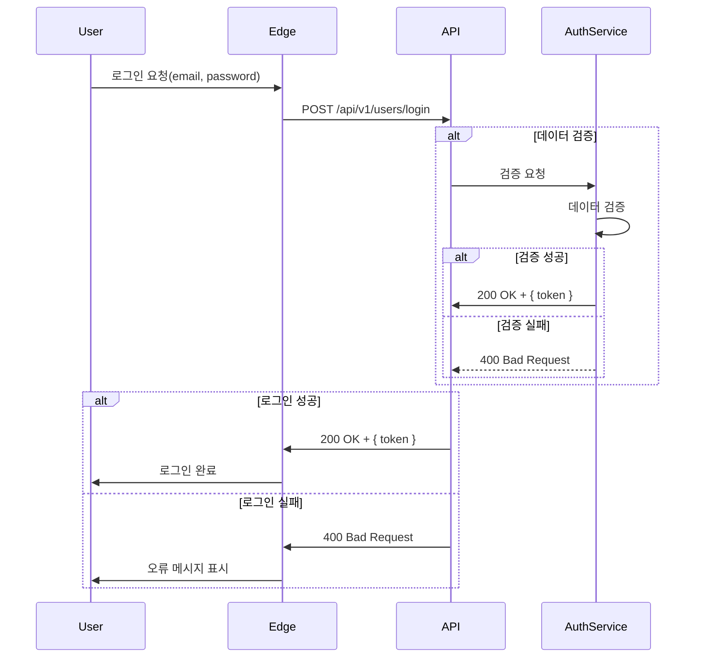
```mermaid
sequenceDiagram
    participant User
    participant Edge
    participant API
    participant AuthService

    User->>Edge: 로그인 요청(email, password)
    Edge->>API: POST /api/v1/users/login
    alt 데이터 검증
        API->>AuthService: 검증 요청
        AuthService->>AuthService: 데이터 검증
        alt 검증 성공
            AuthService->>API: 200 OK + { token }
        else 검증 실패
            AuthService-->>API: 400 Bad Request
        end
    end
    alt 로그인 성공
        API->>Edge: 200 OK + { token }
        Edge->>User: 로그인 완료
    else 로그인 실패
        API->>Edge: 400 Bad Request
        Edge->>User: 오류 메시지 표시
    end
```

### 2.3. 사용자 로그아웃 시퀀스 다이어그램

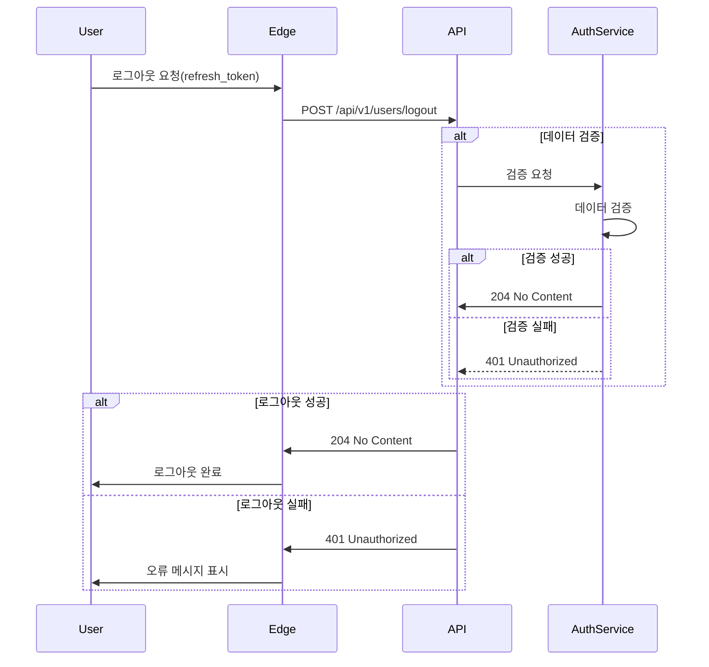
```mermaid
sequenceDiagram
    participant User
    participant Edge
    participant API
    participant AuthService

    User->>Edge: 로그아웃 요청(refresh_token)
    Edge->>API: POST /api/v1/users/logout
    alt 데이터 검증
        API->>AuthService: 검증 요청
        AuthService->>AuthService: 데이터 검증
        alt 검증 성공
            AuthService->>API: 204 No Content
        else 검증 실패
            AuthService-->>API: 401 Unauthorized
        end
    end
    alt 로그아웃 성공
        API->>Edge: 204 No Content
        Edge->>User: 로그아웃 완료
    else 로그아웃 실패
        API->>Edge: 401 Unauthorized
        Edge->>User: 오류 메시지 표시
    end
```

### 2.4. 사용자 회원탈퇴 시퀀스 다이어그램

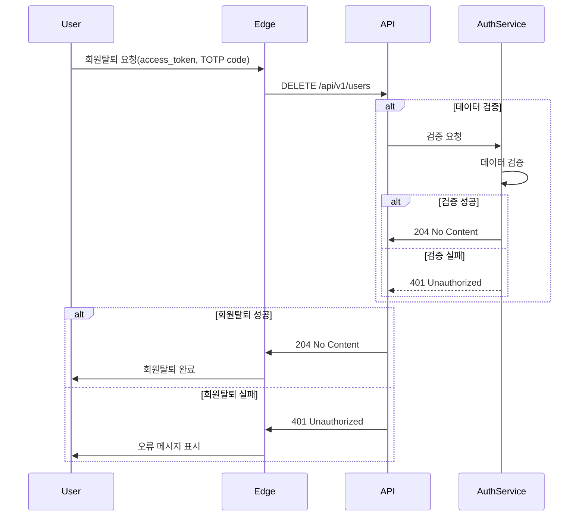
```mermaid
sequenceDiagram
    participant User
    participant Edge
    participant API
    participant AuthService

    User->>Edge: 회원탈퇴 요청(access_token, TOTP code)
    Edge->>API: DELETE /api/v1/users
    alt 데이터 검증
        API->>AuthService: 검증 요청
        AuthService->>AuthService: 데이터 검증
        alt 검증 성공
            AuthService->>API: 204 No Content
        else 검증 실패
            AuthService-->>API: 401 Unauthorized
        end
    end
    alt 회원탈퇴 성공
        API->>Edge: 204 No Content
        Edge->>User: 회원탈퇴 완료
    else 회원탈퇴 실패
        API->>Edge: 401 Unauthorized
        Edge->>User: 오류 메시지 표시
    end
```

### 2.5. 사용자 프로필 조회 시퀀스 다이어그램

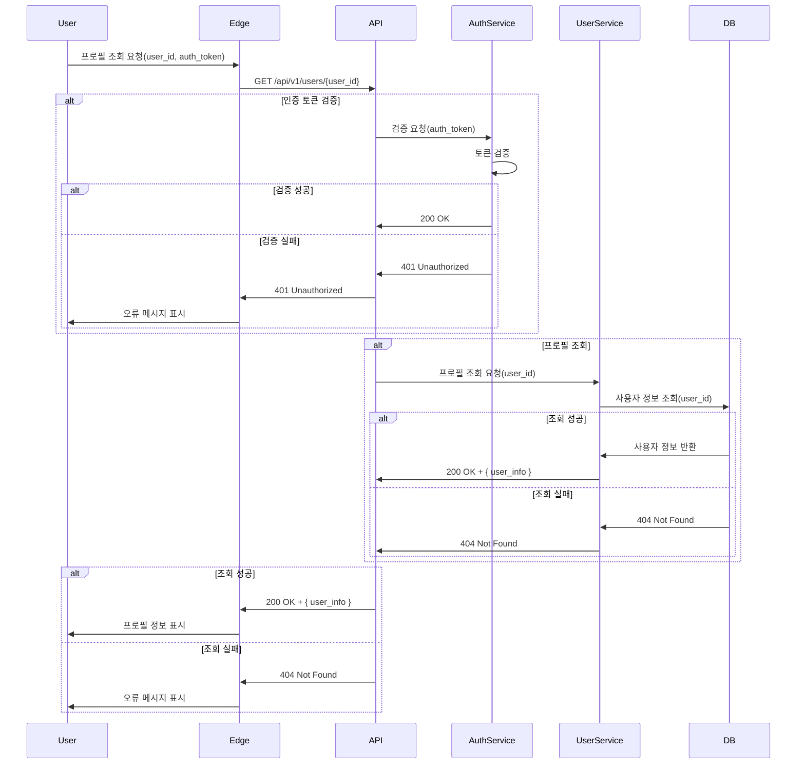
```mermaid
sequenceDiagram
    participant User
    participant Edge
    participant API
    participant AuthService
    participant UserService
    participant DB

    User->>Edge: 프로필 조회 요청(user_id, auth_token)
    Edge->>API: GET /api/v1/users/{user_id}
    alt 인증 토큰 검증
        API->>AuthService: 검증 요청(auth_token)
        AuthService->>AuthService: 토큰 검증
        alt 검증 성공
            AuthService->>API: 200 OK
        else 검증 실패
            AuthService->>API: 401 Unauthorized
            API->>Edge: 401 Unauthorized
            Edge->>User: 오류 메시지 표시
        end
    end
    alt 프로필 조회
        API->>UserService: 프로필 조회 요청(user_id)
        UserService->>DB: 사용자 정보 조회(user_id)
        alt 조회 성공
            DB->>UserService: 사용자 정보 반환
            UserService->>API: 200 OK + { user_info }
        else 조회 실패
            DB->>UserService: 404 Not Found
            UserService->>API: 404 Not Found
        end
    end
    alt 조회 성공
        API->>Edge: 200 OK + { user_info }
        Edge->>User: 프로필 정보 표시
    else 조회 실패
        API->>Edge: 404 Not Found
        Edge->>User: 오류 메시지 표시
    end
```

### 2.6. 사용자 프로필 편집 시퀀스 다이어그램

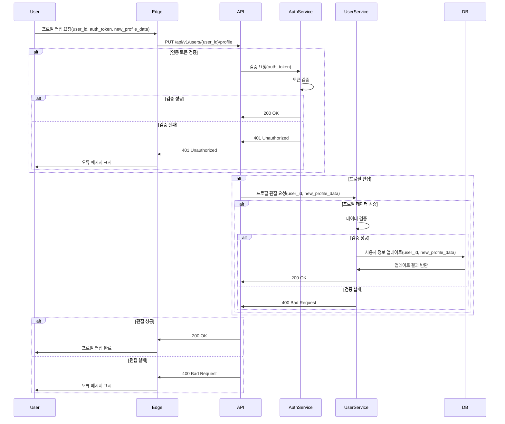
```mermaid
sequenceDiagram
    participant User
    participant Edge
    participant API
    participant AuthService
    participant UserService
    participant DB

    User->>Edge: 프로필 편집 요청(user_id, auth_token, new_profile_data)
    Edge->>API: PUT /api/v1/users/{user_id}/profile
    alt 인증 토큰 검증
        API->>AuthService: 검증 요청(auth_token)
        AuthService->>AuthService: 토큰 검증
        alt 검증 성공
            AuthService->>API: 200 OK
        else 검증 실패
            AuthService->>API: 401 Unauthorized
            API->>Edge: 401 Unauthorized
            Edge->>User: 오류 메시지 표시
        end
    end
    alt 프로필 편집
        API->>UserService: 프로필 편집 요청(user_id, new_profile_data)
        alt 프로필 데이터 검증
            UserService->>UserService: 데이터 검증
            alt 검증 성공
                UserService->>DB: 사용자 정보 업데이트(user_id, new_profile_data)
                DB->>UserService: 업데이트 결과 반환
                UserService->>API: 200 OK
            else 검증 실패
                UserService->>API: 400 Bad Request
            end
        end
    end
    alt 편집 성공
        API->>Edge: 200 OK
        Edge->>User: 프로필 편집 완료
    else 편집 실패
        API->>Edge: 400 Bad Request
        Edge->>User: 오류 메시지 표시
    end
```

### 2.7 사용자 개인정보 수정 시퀀스 다이어그램

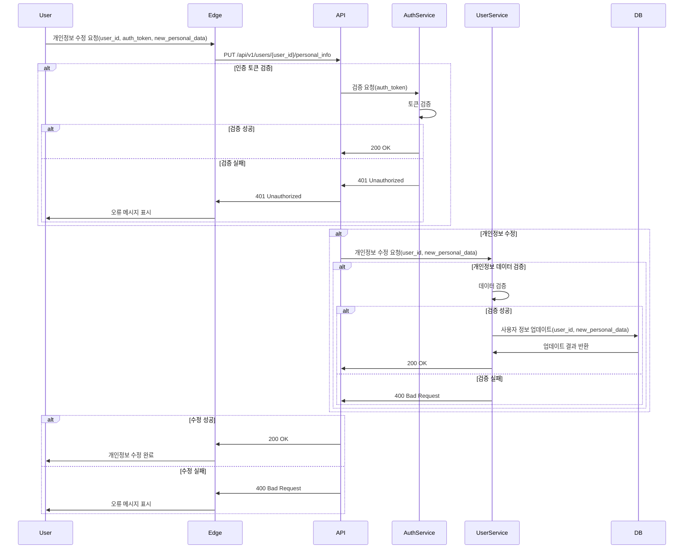
```mermaid
sequenceDiagram
    participant User
    participant Edge
    participant API
    participant AuthService
    participant UserService
    participant DB

    User->>Edge: 개인정보 수정 요청(user_id, auth_token, new_personal_data)
    Edge->>API: PUT /api/v1/users/{user_id}/personal_info
    alt 인증 토큰 검증
        API->>AuthService: 검증 요청(auth_token)
        AuthService->>AuthService: 토큰 검증
        alt 검증 성공
            AuthService->>API: 200 OK
        else 검증 실패
            AuthService->>API: 401 Unauthorized
            API->>Edge: 401 Unauthorized
            Edge->>User: 오류 메시지 표시
        end
    end
    alt 개인정보 수정
        API->>UserService: 개인정보 수정 요청(user_id, new_personal_data)
        alt 개인정보 데이터 검증
            UserService->>UserService: 데이터 검증
            alt 검증 성공
                UserService->>DB: 사용자 정보 업데이트(user_id, new_personal_data)
                DB->>UserService: 업데이트 결과 반환
                UserService->>API: 200 OK
            else 검증 실패
                UserService->>API: 400 Bad Request
            end
        end
    end
    alt 수정 성공
        API->>Edge: 200 OK
        Edge->>User: 개인정보 수정 완료
    else 수정 실패
        API->>Edge: 400 Bad Request
        Edge->>User: 오류 메시지 표시
    end
```

### 2.8. 사용자 팔로우/언팔로우 시퀀스 다이어그램

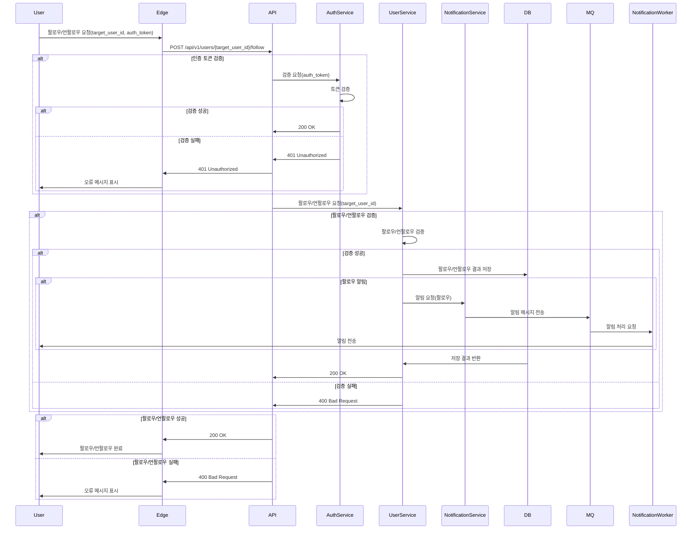
```mermaid
sequenceDiagram
    participant User
    participant Edge
    participant API
    participant AuthService
    participant UserService
    participant NotificationService
    participant DB
    participant MQ
    participant NotificationWorker

    User->>Edge: 팔로우/언팔로우 요청(target_user_id, auth_token)
    Edge->>API: POST /api/v1/users/{target_user_id}/follow
    alt 인증 토큰 검증
        API->>AuthService: 검증 요청(auth_token)
        AuthService->>AuthService: 토큰 검증
        alt 검증 성공
            AuthService->>API: 200 OK
        else 검증 실패
            AuthService->>API: 401 Unauthorized
            API->>Edge: 401 Unauthorized
            Edge->>User: 오류 메시지 표시
        end
    end
    API->>UserService: 팔로우/언팔로우 요청(target_user_id)
    alt 팔로우/언팔로우 검증
        UserService->>UserService: 팔로우/언팔로우 검증
        alt 검증 성공
            UserService->>DB: 팔로우/언팔로우 결과 저장
            alt 팔로우 알림
                UserService->>NotificationService: 알림 요청(팔로우)
                NotificationService->>MQ: 알림 메시지 전송
                MQ->>NotificationWorker: 알림 처리 요청
                NotificationWorker->>User: 알림 전송
            end
            DB->>UserService: 저장 결과 반환
            UserService->>API: 200 OK
        else 검증 실패
            UserService->>API: 400 Bad Request
        end
    end
    alt 팔로우/언팔로우 성공
        API->>Edge: 200 OK
        Edge->>User: 팔로우/언팔로우 완료
    else 팔로우/언팔로우 실패
        API->>Edge: 400 Bad Request
        Edge->>User: 오류 메시지 표시
    end
```

### 2.9. 사용자 OTP 2차 인증 시퀀스 다이어그램

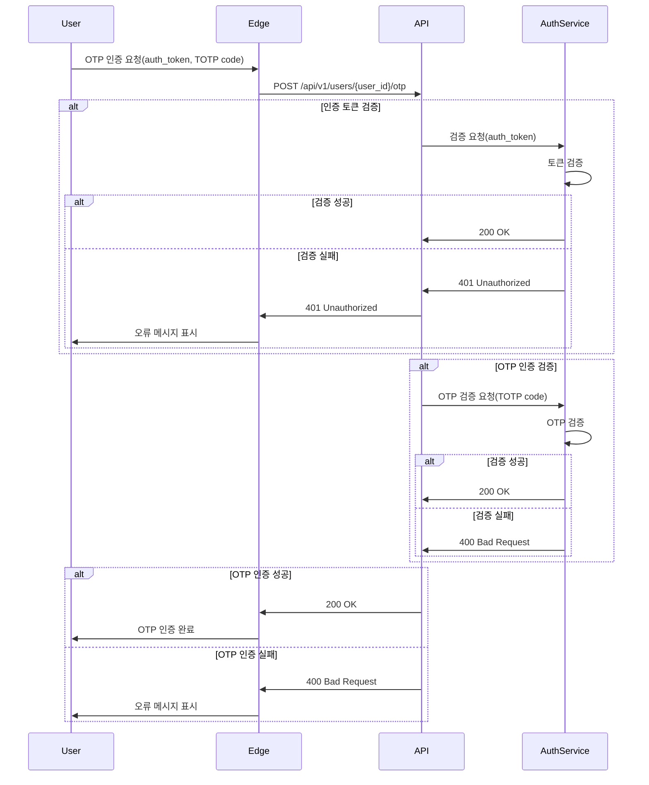
```mermaid
sequenceDiagram
    participant User
    participant Edge
    participant API
    participant AuthService

    User->>Edge: OTP 인증 요청(auth_token, TOTP code)
    Edge->>API: POST /api/v1/users/{user_id}/otp
    alt 인증 토큰 검증
        API->>AuthService: 검증 요청(auth_token)
        AuthService->>AuthService: 토큰 검증
        alt 검증 성공
            AuthService->>API: 200 OK
        else 검증 실패
            AuthService->>API: 401 Unauthorized
            API->>Edge: 401 Unauthorized
            Edge->>User: 오류 메시지 표시
        end
    end
    alt OTP 인증 검증
        API->>AuthService: OTP 검증 요청(TOTP code)
        AuthService->>AuthService: OTP 검증
        alt 검증 성공
            AuthService->>API: 200 OK
        else 검증 실패
            AuthService->>API: 400 Bad Request
        end
    end
    alt OTP 인증 성공
        API->>Edge: 200 OK
        Edge->>User: OTP 인증 완료
    else OTP 인증 실패
        API->>Edge: 400 Bad Request
        Edge->>User: 오류 메시지 표시
    end
```

### 2.10. 포스트 작성 시퀀스 다이어그램

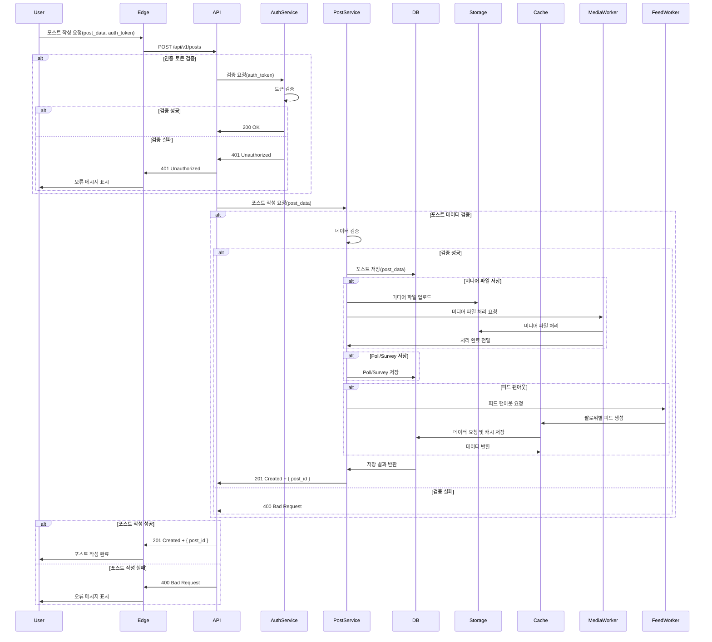
```mermaid
sequenceDiagram
    participant User
    participant Edge
    participant API
    participant AuthService
    participant PostService
    participant DB
    participant Storage
    participant Cache
    participant MediaWorker
    participant FeedWorker

    User->>Edge: 포스트 작성 요청(post_data, auth_token)
    Edge->>API: POST /api/v1/posts
    alt 인증 토큰 검증
        API->>AuthService: 검증 요청(auth_token)
        AuthService->>AuthService: 토큰 검증
        alt 검증 성공
            AuthService->>API: 200 OK
        else 검증 실패
            AuthService->>API: 401 Unauthorized
            API->>Edge: 401 Unauthorized
            Edge->>User: 오류 메시지 표시
        end
    end
    API->>PostService: 포스트 작성 요청(post_data)
    alt 포스트 데이터 검증
        PostService->>PostService: 데이터 검증
        alt 검증 성공
            PostService->>DB: 포스트 저장(post_data)
            alt 미디어 파일 저장
                PostService->>Storage: 미디어 파일 업로드
                PostService->>MediaWorker: 미디어 파일 처리 요청
                MediaWorker->>Storage: 미디어 파일 처리
                MediaWorker->>PostService: 처리 완료 전달
            end
            alt Poll/Survey 저장
                PostService->>DB: Poll/Survey 저장
            end
            alt 피드 팬아웃
                PostService->>FeedWorker: 피드 팬아웃 요청
                FeedWorker->>Cache: 팔로워별 피드 생성
                Cache->>DB: 데이터 요청 및 캐시 저장
                DB->>Cache: 데이터 반환
            end
            DB->>PostService: 저장 결과 반환
            PostService->>API: 201 Created + { post_id }
        else 검증 실패
            PostService->>API: 400 Bad Request
        end
    end
    alt 포스트 작성 성공
        API->>Edge: 201 Created + { post_id }
        Edge->>User: 포스트 작성 완료
    else 포스트 작성 실패
        API->>Edge: 400 Bad Request
        Edge->>User: 오류 메시지 표시
    end
```

### 2.11. 포스트 좋아요 시퀀스 다이어그램

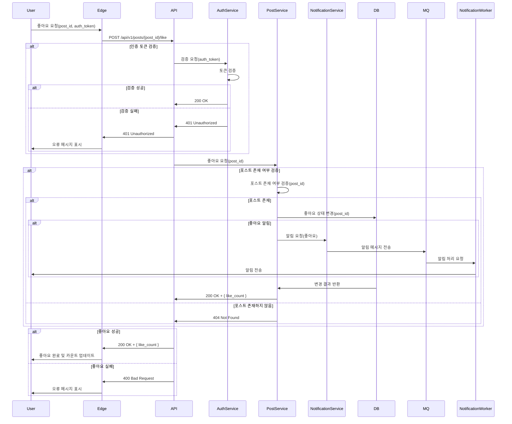
```mermaid
sequenceDiagram
    participant User
    participant Edge
    participant API
    participant AuthService
    participant PostService
    participant NotificationService
    participant DB
    participant MQ
    participant NotificationWorker

    User->>Edge: 좋아요 요청(post_id, auth_token)
    Edge->>API: POST /api/v1/posts/{post_id}/like
    alt 인증 토큰 검증
        API->>AuthService: 검증 요청(auth_token)
        AuthService->>AuthService: 토큰 검증
        alt 검증 성공
            AuthService->>API: 200 OK
        else 검증 실패
            AuthService->>API: 401 Unauthorized
            API->>Edge: 401 Unauthorized
            Edge->>User: 오류 메시지 표시
        end
    end
    API->>PostService: 좋아요 요청(post_id)
    alt 포스트 존재 여부 검증
        PostService->>PostService: 포스트 존재 여부 검증(post_id)
        alt 포스트 존재
            PostService->>DB: 좋아요 상태 변경(post_id)
            alt 좋아요 알림
                PostService->>NotificationService: 알림 요청(좋아요)
                NotificationService->>MQ: 알림 메시지 전송
                MQ->>NotificationWorker: 알림 처리 요청
                NotificationWorker->>User: 알림 전송
            end
            DB->>PostService: 변경 결과 반환
            PostService->>API: 200 OK + { like_count }
        else 포스트 존재하지 않음
            PostService->>API: 404 Not Found
        end
    end
    alt 좋아요 성공
        API->>Edge: 200 OK + { like_count }
        Edge->>User: 좋아요 완료 및 카운트 업데이트
    else 좋아요 실패
        API->>Edge: 400 Bad Request
        Edge->>User: 오류 메시지 표시
    end
```

### 2.12. 포스트 해시태그/멘션 시퀀스 다이어그램

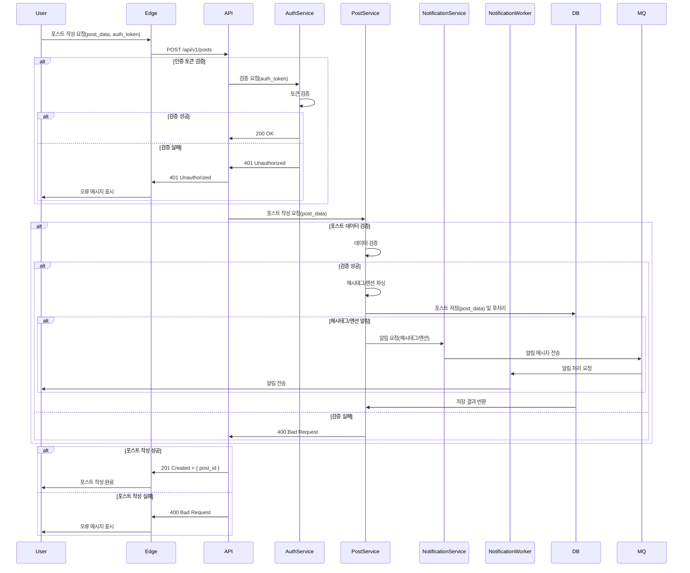
```mermaid
sequenceDiagram
    participant User
    participant Edge
    participant API
    participant AuthService
    participant PostService
    participant NotificationService
    participant NotificationWorker
    participant DB
    participant MQ

    User->>Edge: 포스트 작성 요청(post_data, auth_token)
    Edge->>API: POST /api/v1/posts
    alt 인증 토큰 검증
        API->>AuthService: 검증 요청(auth_token)
        AuthService->>AuthService: 토큰 검증
        alt 검증 성공
            AuthService->>API: 200 OK
        else 검증 실패
            AuthService->>API: 401 Unauthorized
            API->>Edge: 401 Unauthorized
            Edge->>User: 오류 메시지 표시
        end
    end
    API->>PostService: 포스트 작성 요청(post_data)
    alt 포스트 데이터 검증
        PostService->>PostService: 데이터 검증
        alt 검증 성공
            PostService->>PostService: 해시태그/멘션 파싱
            PostService->>DB: 포스트 저장(post_data) 및 후처리
            alt 해시태그/멘션 알림
                PostService->>NotificationService: 알림 요청(해시태그/멘션)
                NotificationService->>MQ: 알림 메시지 전송
                MQ->>NotificationWorker: 알림 처리 요청
                NotificationWorker->>User: 알림 전송
            end
            DB->>PostService: 저장 결과 반환
        else 검증 실패
            PostService->>API: 400 Bad Request
        end
    end
    alt 포스트 작성 성공
        API->>Edge: 201 Created + { post_id }
        Edge->>User: 포스트 작성 완료
    else 포스트 작성 실패
        API->>Edge: 400 Bad Request
        Edge->>User: 오류 메시지 표시
    end
```

### 2.13. 포스트 피드 조회 시퀀스 다이어그램

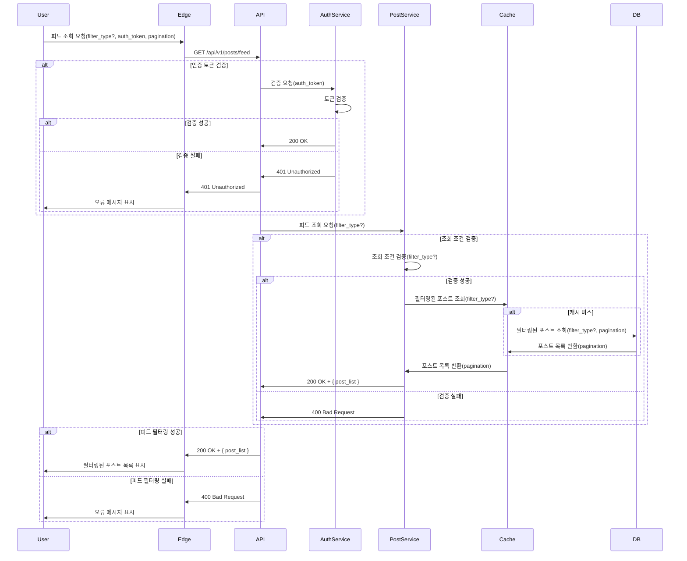
```mermaid
sequenceDiagram
    participant User
    participant Edge
    participant API
    participant AuthService
    participant PostService
    participant Cache
    participant DB

    User->>Edge: 피드 조회 요청(filter_type?, auth_token, pagination)
    Edge->>API: GET /api/v1/posts/feed
    alt 인증 토큰 검증
        API->>AuthService: 검증 요청(auth_token)
        AuthService->>AuthService: 토큰 검증
        alt 검증 성공
            AuthService->>API: 200 OK
        else 검증 실패
            AuthService->>API: 401 Unauthorized
            API->>Edge: 401 Unauthorized
            Edge->>User: 오류 메시지 표시
        end
    end
    API->>PostService: 피드 조회 요청(filter_type?)
    alt 조회 조건 검증
        PostService->>PostService: 조회 조건 검증(filter_type?)
        alt 검증 성공
            PostService->>Cache: 필터링된 포스트 조회(filter_type?)
            alt 캐시 미스
                Cache->>DB: 필터링된 포스트 조회(filter_type?, pagination)
                DB->>Cache: 포스트 목록 반환(pagination)
            end
            Cache->>PostService: 포스트 목록 반환(pagination)
            PostService->>API: 200 OK + { post_list }
        else 검증 실패
            PostService->>API: 400 Bad Request
        end
    end
    alt 피드 필터링 성공
        API->>Edge: 200 OK + { post_list }
        Edge->>User: 필터링된 포스트 목록 표시
    else 피드 필터링 실패
        API->>Edge: 400 Bad Request
        Edge->>User: 오류 메시지 표시
    end
```

### 2.14. 포스트 검색 시퀀스 다이어그램

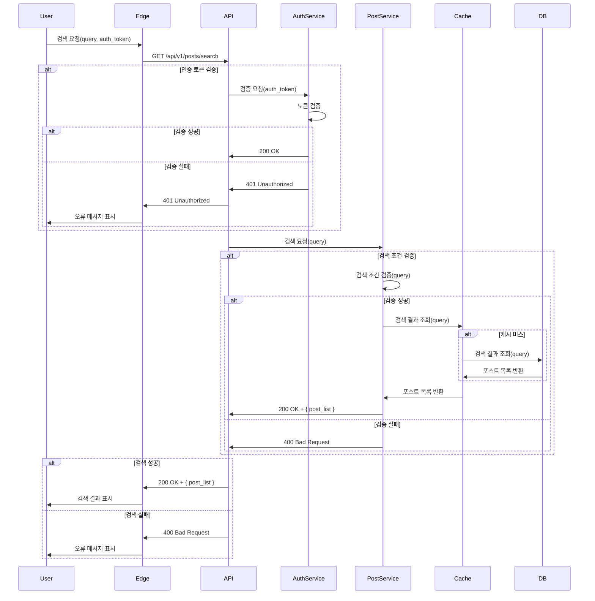
```mermaid
sequenceDiagram
    participant User
    participant Edge
    participant API
    participant AuthService
    participant PostService
    participant Cache
    participant DB

    User->>Edge: 검색 요청(query, auth_token)
    Edge->>API: GET /api/v1/posts/search
    alt 인증 토큰 검증
        API->>AuthService: 검증 요청(auth_token)
        AuthService->>AuthService: 토큰 검증
        alt 검증 성공
            AuthService->>API: 200 OK
        else 검증 실패
            AuthService->>API: 401 Unauthorized
            API->>Edge: 401 Unauthorized
            Edge->>User: 오류 메시지 표시
        end
    end
    API->>PostService: 검색 요청(query)
    alt 검색 조건 검증
        PostService->>PostService: 검색 조건 검증(query)
        alt 검증 성공
            PostService->>Cache: 검색 결과 조회(query)
            alt 캐시 미스
                Cache->>DB: 검색 결과 조회(query)
                DB->>Cache: 포스트 목록 반환
            end
            Cache->>PostService: 포스트 목록 반환
            PostService->>API: 200 OK + { post_list }
        else 검증 실패
            PostService->>API: 400 Bad Request
        end
    end
    alt 검색 성공
        API->>Edge: 200 OK + { post_list }
        Edge->>User: 검색 결과 표시
    else 검색 실패
        API->>Edge: 400 Bad Request
        Edge->>User: 오류 메시지 표시
    end
```

### 2.15. 알림 전달 시퀀스 다이어그램

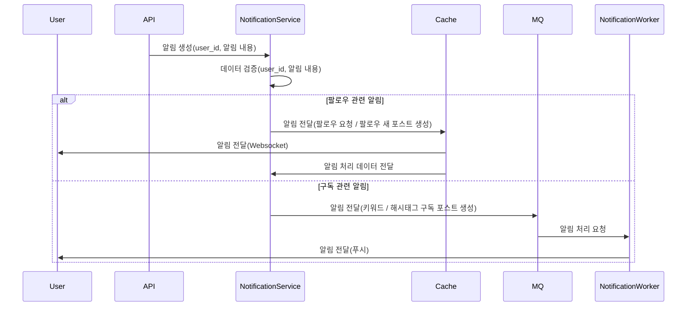
```mermaid
sequenceDiagram
    participant User
    participant API
    participant NotificationService
    participant Cache
    participant MQ
    participant NotificationWorker

    API->>NotificationService: 알림 생성(user_id, 알림 내용)
    NotificationService->>NotificationService: 데이터 검증(user_id, 알림 내용)
    alt 팔로우 관련 알림
        NotificationService->>Cache: 알림 전달(팔로우 요청 / 팔로우 새 포스트 생성)
        Cache->>User: 알림 전달(Websocket)
        Cache->>NotificationService: 알림 처리 데이터 전달
    else 구독 관련 알림
        NotificationService->>MQ: 알림 전달(키워드 / 해시태그 구독 포스트 생성)
        MQ->>NotificationWorker: 알림 처리 요청
        NotificationWorker->>User: 알림 전달(푸시)
    end
```

### 2.16. 로깅 / 모니터링 시퀀스 다이어그램

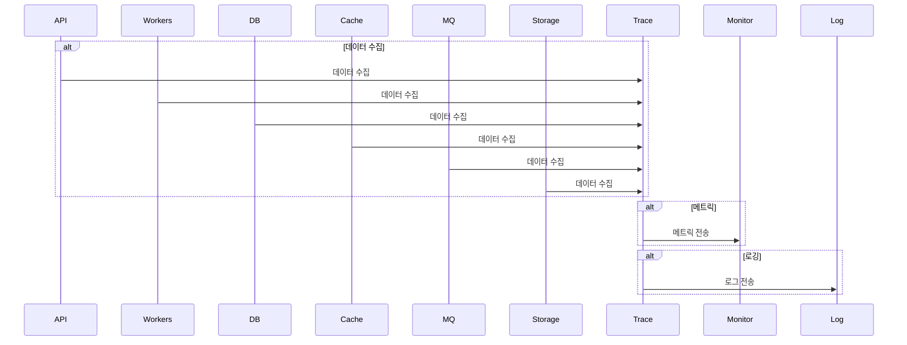
```mermaid
sequenceDiagram
    participant API
    participant Workers
    participant DB
    participant Cache
    participant MQ
    participant Storage
    participant Trace
    participant Monitor
    participant Log

    alt 데이터 수집
        API->>Trace: 데이터 수집
        Workers->>Trace: 데이터 수집
        DB->>Trace: 데이터 수집
        Cache->>Trace: 데이터 수집
        MQ->>Trace: 데이터 수집
        Storage->>Trace: 데이터 수집
    end
    alt 메트릭
        Trace->>Monitor: 메트릭 전송
    end
    alt 로깅
        Trace->>Log: 로그 전송
    end
```
